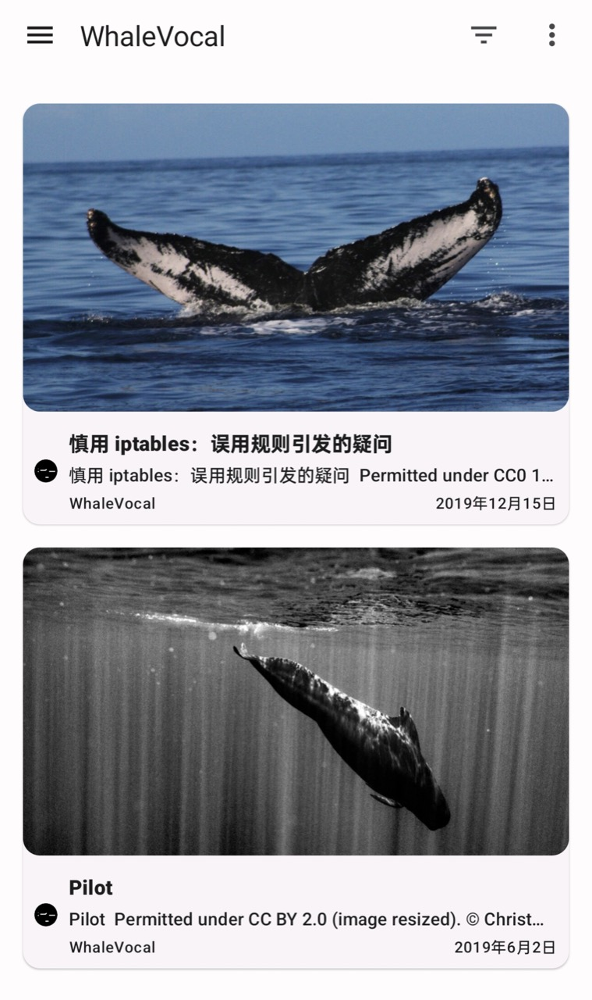

# 基于 VitePress 开发博客主题

. [*commons.wikimedia.org*](https://commons.wikimedia.org/wiki/File:Vaquita6_Olson_NOAA.jpg).")

前两天完成了这个博客的最后一个功能 (Atom Feed)。本来打算在 2023 年最后一天写一篇总结，但刚好有朋友邀约去爬大南山[^nanshan]，所以推迟到新年的第一天。对于爬山我的态度很明确，不愿爬，不怕爬，必要时不得不爬：

[^nanshan]: [大南山 (深圳)](https://zh.wikipedia.org/zh-cn/大南山_(深圳))


言归正传，这篇总结主要列举基于 VitePress 做一个博客主题需要解决的问题。我还没系统地学过 Vite、Vue 和 TypeScript，所以注定有些代码实现不是最佳实践。目前写文章是我的第一需要，也许等到下个阶段我会抽出时间来重构。

## 开发环境

- Node.js & VS Code: [Octobug/blog/.github/contributing.md](https://github.com/Octobug/blog/blob/main/.github/contributing.md)
- Git Hooks
  - [typicode/husky](https://github.com/typicode/husky)
  - [lint-staged/lint-staged](https://github.com/lint-staged/lint-staged)
- Linters
  - [eslint/eslint](https://github.com/eslint/eslint)
  - [igorshubovych/markdownlint-cli](https://github.com/igorshubovych/markdownlint-cli)

## 自定义 VitePress 主题

VitePress 的官方文档相当详细，新手直接按顺序阅读 [Guide](https://vitepress.dev/guide/getting-started) 部分就能上手，需要查阅接口信息时往往可以通过搜索进入 [Reference](https://vitepress.dev/reference/site-config) 部分。

用代码扩展 VitePress 时需要注意两个概念：“构建时 (Build-Time)”和“运行时 (Runtime)”。这两个概念最根本的区别是其执行环境：

- 构建时：本地 Node.js 提供的运行、构建环境
- 运行时：构建打包后的代码运行于浏览器环境

更细致的区别是由 VitePress 的生命周期决定的，但目前官方文档没有详细介绍其生命周期。不过有时候理解错了也能通过报错来区分出是哪个阶段的问题。

### 自定义 CSS

- 自定义 CSS：[Extending the Default Theme - Customizing CSS](https://vitepress.dev/guide/extending-default-theme#customizing-css)
- 颜色建议使用 VitePress 预定义的变量名：[vuejs/vitepress/src/client/theme-default/styles/vars.css](https://github.com/vuejs/vitepress/blob/main/src/client/theme-default/styles/vars.css)
  - 对实现夜间模式友好
  - 如果想改变颜色只需要覆盖默认的变量值

⚠️ 在 `<style module></style>`（即打开 `module` 模式）中，嵌套的 CSS 似乎不兼容 Safari 浏览器，但只要不写嵌套的 CSS 代码就没问题。

### 页面布局

VitePress 的 Markdown 文件有几个类型，通过 `frontmatter` 中的 `layout` 指定，比如 `layout: home`、`layout: page`。

自定义布局主要参考这几个部分：

- [Using a Custom Theme - Building a Layout](https://vitepress.dev/guide/custom-theme#building-a-layout)
- Extending the Default Theme
  - [Registering Global Components](https://vitepress.dev/guide/extending-default-theme#registering-global-components)
  - [Layout Slots](https://vitepress.dev/guide/extending-default-theme#layout-slots)

当你用 Vue 组件自行实现了某个页面，可以根据 "Registering Global Components" 将其注册为全局组件。这样就可以在 Markdown 页面（区别于作为文章的 Markdown）中使用这个页面组件，避免在自定义 Layout 时混杂太多不同页面的实现。详情见：[Octobug/blog/.vitepress/theme/pages](https://github.com/Octobug/blog/tree/main/.vitepress/theme/pages)。

### SSR 兼容性

构建生成的静态网站中，如果有页面存在动态内容（比如显示时间），在浏览器 console 会报如下错误：

:::danger Error
Hydration completed but contains mismatches.
:::

这种情况可以使用 `<ClientOnly><NonSSRFriendlyComponent /></ClientOnly>` 将动态部分包裹起来：[SSR Compatibility - `<ClientOnly>`](https://vitepress.dev/guide/ssr-compat#clientonly)。

## 常见的博客功能

### 首页、归档、分类与标签

- 首页：按时间线倒序显示文章列表并分页
- 归档：按倒序列出每个年份的文章列表
- 分类：在分类页按照分类过滤文章，每篇文章只有一个分类归属
- 标签：在标签页按照标签过滤文章，每篇文章可以有若干个标签

这几个页面都使用 [Build-Time Data Loading - Data from Local Files](https://vitepress.dev/guide/data-loading#data-from-local-files) 来加载文章列表，免去自己用文件读写（如使用 [isaacs/node-glob](https://github.com/isaacs/node-glob)）获取文章列表的麻烦。

### Markdown 文章

#### 文章目录结构

文章有时会包含图片文件，这些图片要集中放在一起（比如放在 `assets/` 目录中）还是各自和所属文章放在一起？经过一番纠结之后，我选择了后者。因为这样在引用图片时可以用最短的相对路径，同时图片文件也更好管理。每篇 Markdown 文章对应一个目录，与其相关的文件都放在同一个目录里：

```sh
$ tree posts
posts
├── an-https-issue-on-adas
│   ├── README.md
│   ├── spinner-dolphin.gif
│   └── spinner-dolphin.jpg
├── better-not-mess-around-with-iptables
│   ├── README.md
│   └── bcy0094.jpg
├── building-a-vitepress-blog-theme
│   ├── README.md
│   ├── feeder-screenshot.jpg
│   ├── vaquita.jpg
│   └── view-from-the-top-of-nanshan.jpg
├── non-original-content-copyright-issues
│   ├── README.md
│   ├── aigc-best.jpg
│   ├── aigc-worst.jpg
│   └── baiji-qiqi.jpg
└── pilot
    ├── README.md
    └── pilot-whale.jpg
```

- 详情见：[Octobug/blog/posts](https://github.com/Octobug/blog/tree/main/posts)
- 为了让 URL 看起来优雅一些，可以使用 `rewrites` 重写路由：
  - [Octobug/blog/.vitepress/config.ts](https://github.com/Octobug/blog/blob/fd29f537ba9a40e84fe8c527263e5c0f6a119e42/.vitepress/config.ts#L41)
  - [Routing - Route Rewrites](https://vitepress.dev/guide/routing#route-rewrites)

#### 文章要素

每篇文章的标题下方都加了这三个要素：

1. **日期**（星期几）
2. **地点**（乡镇级区划信息）：记录文字是在什么地方写下的，回忆会更加具象化 `:)`
   - 由于写文章的地方不会非常多变，所以最后决定不使用中国的行政区划信息库。
   - 而且，万一以后有机会出国写一篇呢？
3. **阅读时长**（文章长度）

在 VitePress 中，文章标题和正文是一个 `<Content />` 整体，不可拆分。要在文章标题下方插入上面这行“三要素”有几个方案：

1. ❌ **在每篇 Markdown 文章中插入全局注册的 Vue 组件**：这个方案对于后续写文章来说过于繁琐。
2. ❌ **使用 frontmatter title，而不使用 Markdown 一级标题**：VitePress 为文章建立索引时将段落和其前面最近的一个标题归入同个 section，如果不使用 Markdown 一级标题，会导致第一个标题前面的内容不被索引而搜索不到。
   - [vuejs/vitepress/src/node/plugins/localSearchPlugin.ts](https://github.com/vuejs/vitepress/blob/27f60e0b7784603c6fb300bd8dce64515eb98962/src/node/plugins/localSearchPlugin.ts#L226C35-L226C35)
   - 这一点我不认为是 bug，因为规范的 Markdown 就是要有一个 `# 一级标题`
3. ❌ **使用 JavaScript 操作 DOM 元素**：先将 Vue 组件放在 Layout 的 doc slots 里面，再用 JS 把渲染后的 DOM 元素搬运到标题之下。这个方案过于 hack 过于丑陋。
4. ✅ **通过 VitePress 的 markdown-it 接口写类插件代码**：[markdown-it API](https://markdown-it.github.io/markdown-it/) 很复杂，但它是最适合做这件事的：
    1. 将需要插入 Markdown 文章中间的 Vue 组件注册为全局组件；
    2. 改写 `md.renderer.rules[token.type]` 渲染函数，将 Vue 组件插入到 markdown-it 的渲染结果中；
    3. VitePress 会进一步处理 Markdown 渲染后的 HTML，此时插入的 Vue 组件才会被编译：[Using Vue in Markdown](https://vitepress.dev/guide/using-vue#using-vue-in-markdown)。

例如：

```ts
md.renderer.rules.heading_close = (tokens, idx, options, _env, self) => {
  let result = self.renderToken(tokens, idx, options);
  if (tokens[idx].markup === "#") {
    result += "\n\n<PostElements />\n\n";
  }
  return result;
};
```

详情见：[Octobug/blog/.vitepress/theme/mdit.ts](https://github.com/Octobug/blog/blob/main/.vitepress/theme/mdit.ts)。

#### 上一页/下一页

VitePress 本身有“上一页/下一页”的功能，但需要将文章列表数据喂给 [Sidebar](https://vitepress.dev/reference/default-theme-sidebar#sidebar) 才会触发这个页面组件。然而在 `.vitepress/config.ts` 中无法使用 [Build-Time Data Loading - `createContentLoader`](https://vitepress.dev/guide/data-loading#createcontentloader) 接口加载文章列表：[vuejs/vitepress/discussions - can I use createContentLoader in config.js?](https://github.com/vuejs/vitepress/discussions/2790#discussioncomment-6729116)

也就是说需要自行读写文件把文章列表数据喂给 `sidebar`，这就有点得不偿失。所以我选择自行实现“上一页/下一页”组件，为了保持样式一致，这个组件基本上是从 VitePress 源代码中 copy 的：[Octobug/blog/.vitepress/theme/components/PrevNext.vue](https://github.com/Octobug/blog/blob/main/.vitepress/theme/components/PrevNext.vue)。

#### markdown-it 插件

[markdown-it/markdown-it](https://github.com/markdown-it/markdown-it) 非常强大，插件使用方便，且插件生态也足够丰富。但它的开发 API 有些复杂，文档对新手很不友好。

如何在 VitePress 中使用 markdown-it 插件：[Markdown Extensions - Advanced Configuration](https://vitepress.dev/guide/markdown#advanced-configuration)。

已使用插件列表：

- **图片注解**：[arve0/markdown-it-implicit-figures](https://github.com/arve0/markdown-it-implicit-figures)
  - 使用示例：[vuejs/vitepress/issues - Image captions](https://github.com/vuejs/vitepress/issues/892#issuecomment-1172840466)
- **自动生成引用脚注**：[markdown-it/markdown-it-footnote](https://github.com/markdown-it/markdown-it-footnote)
  - 扩展插件功能：自动为引用链接追加显示域名（这个功能我研究了一晚上才找到合适的 API）
  - 调整插件样式：[Octobug/blog/.vitepress/theme/style.css](https://github.com/Octobug/blog/blob/17e8383da904d7c9f550ab35b0dfebe292dde09a/.vitepress/theme/style.css#L256C10-L256C10)
- **图表**：[emersonbottero/vitepress-plugin-mermaid](https://github.com/emersonbottero/vitepress-plugin-mermaid)

#### 处理图片文件大小

对于部署在 GitHub Pages、Netlify 这些免费托管平台上的静态网站来说，图片文件如果太大十分影响用户体验。每次手动用 Photoshop 之类的软件处理图片大小都让我觉得很繁琐。macOS 系统用户可以用自带的 `sips` 命令来处理，相较于使用 GUI 软件处理要快捷非常多。比如将一张图的长边分辨率转成 `1080 px`，且保留图片比例：

```sh
sips -Z 1080 origin.jpg -o resized.jpg
```

作为意外收获，`sips` 压缩图片大小的效果特别好。在生成同样大小的图片时，`sips` 保留原图视觉效果的能力甚至比 Photoshop 还强。

### 文章评论

giscus 是基于 GitHub Discussions 实现的评论系统，它也提供了 Vue 组件，集成到 VitePress 中还算方便。

giscus 用 `<iframe>` 实现整个组件，CSS 需要通过 HTTP 加载，所以在 VitePress 切换日/夜间模式时加载新的 CSS 会有明显的延时，导致整个评论区域的颜色有切换“闪烁”。我的解决方案是干脆重新加载整个评论组件：

- [Octobug/blog/.vitepress/theme/components/Comments.vue](https://github.com/Octobug/blog/blob/main/.vitepress/theme/components/Comments.vue)
- [giscus/giscus](https://github.com/giscus/giscus)
  - 凭证与配置生成：[giscus.app](https://giscus.app/)
  - Vue 组件使用 demo：[giscus/giscus-component/demo/vue/src/App.vue](https://github.com/giscus/giscus-component/blob/main/demo/vue/src/App.vue)

接入 giscus 时我发现 Vue 组件版本在浏览器 console 有多余的输出，所以向开发者提了个问，目前这个问题已经被解决：[giscus/giscus-component/discussions - How to suppress this information output by giscus?](https://github.com/giscus/giscus-component/discussions/1897)

### 中文搜索

VitePress 自带全文搜索：[Search - Local Search](https://vitepress.dev/reference/default-theme-search#local-search)，这个搜索是通过 [lucaong/minisearch](https://github.com/lucaong/minisearch/) 实现的。

不幸的是，minisearch 默认不支持中文分词，所以中文搜索效果很差。要实现比较好的中文搜索需自行实现 minisearch 的 `tokenize` 函数：[lucaong/minisearch/issues - how to correctly search for phone numbers](https://github.com/lucaong/minisearch/issues/130#issuecomment-1046658483)。

在 [lucaong/minisearch/issues - Excuse me, how to support other language search, such as Chinese search, thank you](https://github.com/lucaong/minisearch/issues/201) 中有人推荐使用 [yanyiwu/nodejieba](https://github.com/yanyiwu/nodejieba) 或 [`Intl.Segmenter`](https://developer.mozilla.org/en-US/docs/Web/JavaScript/Reference/Global_Objects/Intl/Segmenter) 做中文分词。其中 nodejieba 似乎不支持浏览器端运行，目前没找到在 VitePress 中使用它的方案。而 `Intl.Segmenter` 还没有被 Firefox 支持，且移动端的分词效果也一般。

但 `Intl.Segmenter` 是目前找到的唯一可行的方案，所以最终还是采用了它。详情见：[Octobug/blog/.vitepress/theme/search.ts](https://github.com/Octobug/blog/blob/main/.vitepress/theme/search.ts)

## 其他

### 订阅流

在这之前，我以为文字订阅流都是 RSS 标准，在计划做这个功能时才知道还有个标准叫 [The Atom Syndication Format](https://datatracker.ietf.org/doc/html/rfc4287)。它们的主要区别见：[Difference Between RSS and ATOM](https://www.tutorialspoint.com/difference-between-rss-and-atom)

如今除了写博客的人，应该已经很少人使用 RSS 了。我问了几个非计算机专业的朋友，他们甚至听都没听说过。但既然我是在做一个博客主题，理所应当把这个经典功能加上。

- 参考：[clark-cui/vitepress-blog-zaun/.vitepress/theme/rss.ts](https://github.com/clark-cui/vitepress-blog-zaun/blob/master/.vitepress/theme/rss.ts)
- 实现：[Octobug/blog/.vitepress/theme/feed.ts](https://github.com/Octobug/blog/blob/main/.vitepress/theme/feed.ts)

这个效果我觉得还行：

{.zoom07}

### Google Analytics

[Google Analytics](https://analytics.google.com/) 的功能菜单非常乱，我到现在都不理解为什么一个平台可以设计得这么难用。但它提供的访问数据统计很有价值：[Site Config - Example: Using Google Analytics](https://vitepress.dev/reference/site-config#example-using-google-analytics)

---

以上大部分功能是在最近两个月内抽空零散实现的。在时间上这么分散的原因是，很多功能一开始我根本不知道要做成什么样，等到基本构思清楚了才开始动手。

这个博客还有少数计划中的页面没上线，不过它们不属于典型的博客功能，所以对别人来说可能没有参考价值。

:::details Vaquita Porpoise

封面图是一只小头鼠海豚 (Vaquita Porpoise)[^vaquita] 妈妈领着她的幼崽[^mom_and_calf]。小头鼠海豚目前在 IUCN 红色名录中处于极度濒危级别，2022 年仅剩 18 个有记录的成年个体[^ce_vaquita]。

:::

[^vaquita]: [Vaquita](https://en.wikipedia.org/wiki/Vaquita)
[^mom_and_calf]: [Endangered Vaquita Porpoise Not Doomed to Extinction by Inbreeding Depression](https://www.fisheries.noaa.gov/feature-story/endangered-vaquita-porpoise-not-doomed-extinction-inbreeding-depression)
[^ce_vaquita]: [Phocoena sinus (Vaquita)](https://www.iucnredlist.org/species/17028/214541137)
