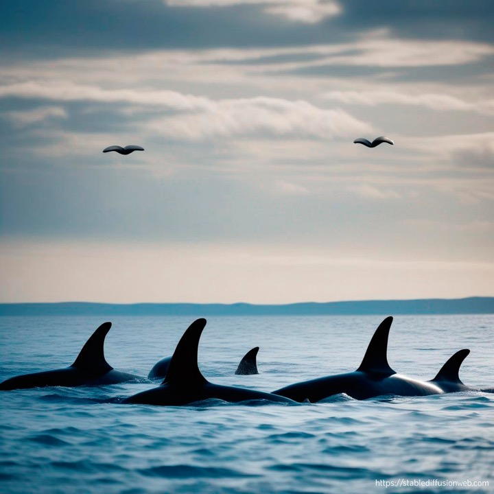
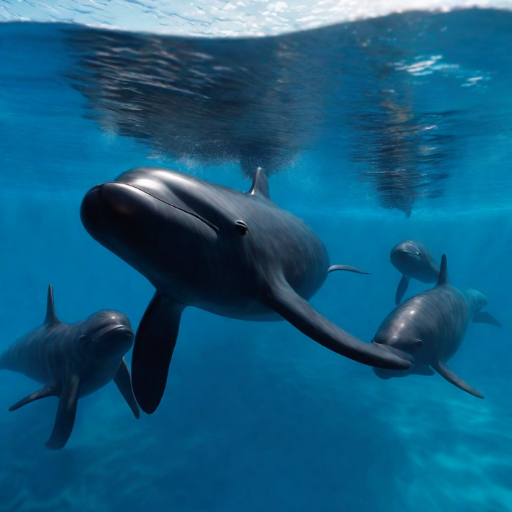

# 公开使用非原创内容的版权问题

. [CC BY-SA 3.0](https://creativecommons.org/licenses/by/3.0/).")

前不久写本站第一篇文章时随手配了一张通过 Google 搜到的图片，越看越喜欢，所以决定尽量给每一篇文章配个封面图。

这两天突然想到，直接拿别人的图来用，虽然是非商业用途，也许不是法律意义上的侵权，但不一定符合作者意愿，所以搜索了一番。然后看到这个贴子：

[Can I just cite the source of a copyrighted image if I use it for my website?](https://www.quora.com/Can-I-just-cite-the-source-of-a-copyrighted-image-if-I-use-it-for-my-website). *quora.com*.

结果比较让我意外，未经授权的非商业用途也是侵权。所以我赶紧撤掉已经用上的两张照片，并琢磨怎么解决这个问题。

## 内容平台

国外相对来说更注重版权，所以已经发展出很多解决版权问题的内容平台。国内现在也有这类平台，但内容的数量和质量都比不上国外的主流平台。

### 收费授权

收费授权的内容平台有很多，随便 Google 就有。我看了几个站点，平均来说，这些平台的内容质量相对于免费授权平台确实更好，一张图单卖大约是 10 美金，如果购买套餐会便宜一些。这个定价对于穷鬼（比如我）的不合理之处在于，它们没有区分商业用途和非商业用途。我用商用的价格买一张图片的使用权用于非商业用途，多少会有点心疼钱。

### 免费授权

免费授权的内容平台也有很多，使用的时候注意注明来源即可。有些授权协议甚至不要求注明来源，但出于对作者的尊重，以及方便观众读者溯源，建议一律注明来源。免费平台重点推荐这三个：

#### Openverse

> An extensive library of free stock photos, images, and audio, available for free use.

[Openverse](https://openverse.org/) 可以理解为免费授权内容的搜索引擎，它的内容是从其他内容平台索引而来。当内容作者将他们的作品标记为免费授权，Openverse 可能就会收录这些内容。

:::danger 注意！
Openverse 的索引可能是过时的。当作者改变其作品的授权方式，比如从某个允许非商用的协议改成 "All Rights Reserved"（“版权所有 不得转载”），Openverse 不一定会及时更新。

所以当你要搬运 Openverse 上面的内容时，最好点进去源头看，避免无意间的侵权。
:::

#### Wikimedia Commons

> A collection of 100,969,531 freely usable media files to which anyone can contribute.

[Wikimedia Commons](https://commons.wikimedia.org/wiki/Main_Page) 也是 [Wikimedia 基金会](https://wikimediafoundation.org/) 的项目，上面的内容完全免费，可以放心使用。

这个平台的缺点是内容比较少，而且很多图片是古早图，分辨率很低。

#### iNaturalist

> Explore and share your observations from the natural world.

[iNaturalist](https://www.inaturalist.org) 上面的图片主要关于野生动植物。它们是科学家、博物学家和业余爱好者上传的，同时往往会有详细的时间、地点、物种名称等观测记录信息。这些图片不全是免费授权，使用时需要一一确认授权许可。

#### 其他

- [Pexels](https://www.pexels.com/): The best free stock photos, royalty free images & videos shared by creators.
- [Unsplash](https://unsplash.com/): The internet’s source for visuals.
Powered by creators everywhere.
- [FreeImages](https://www.freeimages.com/): Free Images: Photos, Vectors, Clipart, Icons, PSD & more!
- [Pixabay](https://pixabay.com/): Stunning royalty-free images & royalty-free stock

## 政府网站

政府部门的运营经费本质上是纳税人提供的~~而不是印钞机印出来的 😝~~。很多政府部门在其网站上发布的原创内容免费对公众开放，有些甚至干脆不受版权法保护。但是，政府网站上面的内容不一定都属于政府，也可能是他人授权政府使用。所以搬运内容的时候也要仔细确认。

以美国为例，请看这个贴子：

[Is it legal to use images taken off a U.S. government website? Is it okay because they're not a private company?](https://www.quora.com/Is-it-legal-to-use-images-taken-off-a-U-S-government-website-Is-it-okay-because-theyre-not-a-private-company). *quora.com*.

我预计之后会使用 [Fisheries and Oceans Canada (加拿大渔业和海洋部)](https://www.dfo-mpo.gc.ca/) 网站上面的一张图，所以再以加拿大政府网站为例，看一下它们对非商业使用的授权条款：

> **Non-commercial reproduction**
>
> Information on this website has been published with the intent that it be readily available for personal or public non-commercial use. Unless otherwise specified, users may reproduce all published information in whole or in part, and in any format, without charge or further permission.
>
> Users are required to:
>
> - exercise due diligence in ensuring the accuracy of the materials reproduced
> - indicate both the complete title of the materials reproduced, as well as the author (where available)
> - indicate that the reproduction is a copy of the version available at [URL where original document is available]
>
> [Terms and conditions](https://www.dfo-mpo.gc.ca/terms-conditions-avis-eng.htm). *dfo-mpo.gc.ca*.

基本上，使用时只要充分注明内容来源即可。

## AI 生成图

鉴于最近 AIGC [[1]] 很火，我也尝试用了一下 AI 文生图。结果生成的图片很无厘头，可以说是降本增笑了。鉴于没有我满意的生成结果，我就不推荐网站了。这里放两张生成图（在不同的网站使用一样的 `prompt` [[2]]）：

## 独立网站

如果你从 Google 的图片搜索结果中挑选自己最喜欢的图片，你选中的图片大概率就是优秀的摄影师或团队独立网站上的内容。如果运气好，作者可能会允许非商业免费使用，但大部分都是 All Rights Reserved。

我先前使用的那两张封面图所在网站都没有写明具体的授权许可。所以我尝试在收费、免费平台找相似的图，但是目前没找到可以媲美那两张图的。真是贵妇野猪吃细糠——再也回不去了。搜寻无果，我就给那两张图片的作者团队写了邮件请求授权，目前还没收到回复。

## 如何获取授权

斯坦福大学有篇文章介绍获取授权的流程：

[The Basics of Getting Permission](https://fairuse.stanford.edu/overview/introduction/getting-permission/). *fairuse.stanford.edu*.

一般来说，需要考虑这五个步骤：

1. 确认是否需要授权；
2. 确认内容原创者；
3. 确认自己需要哪些授权（比如是否商用，是否需要二次创作等）；
4. 联系作者，询问是否需要付费；
5. 获取书面授权（个人用途通常一封邮件就够了）。

如果联系作者没有回音，也许是还没看到你的请求，也许是请求太多回复不过来，也许是其他原因……总之，遇到这种情况就只能暂时放弃了。

---

:::details 封面图

本站第一张经过许可的封面图是一只名为“淇淇” [[3]] 的雄性白鱀豚 (Baiji) [[4]]，死于 2002 年 7 月 14 日。淇淇是最后的确切的白𬶨豚活体记录，目前国际学界普遍认为白鱀豚已经功能性灭绝 [[4]]。

:::

## References

1. [AI-Generated Content (AIGC): A Survey][1]. *arxiv.org*.
2. [Prompt engineering][2]. *en.wikipedia.org*.
3. [淇淇][3]. *zh.wikipedia.org*.
4. [Baiji][4]. *en.wikipedia.org*.

[1]: <https://arxiv.org/pdf/2304.06632.pdf>
[2]: <https://en.wikipedia.org/wiki/Prompt_engineering>
[3]: <https://zh.wikipedia.org/wiki/淇淇>
[4]: <https://en.wikipedia.org/wiki/Baiji>
